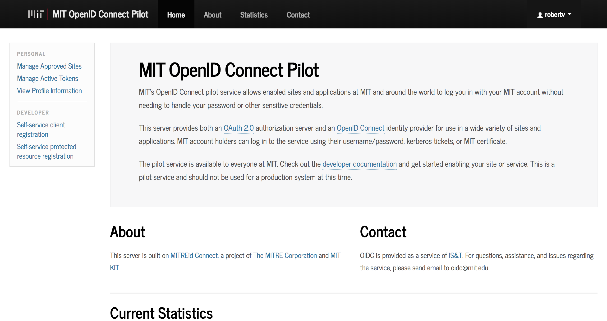
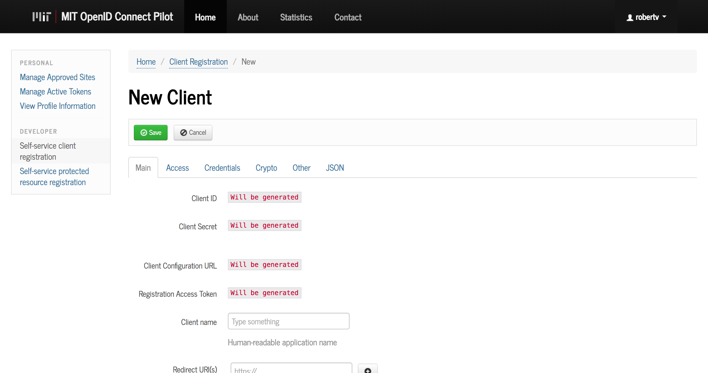
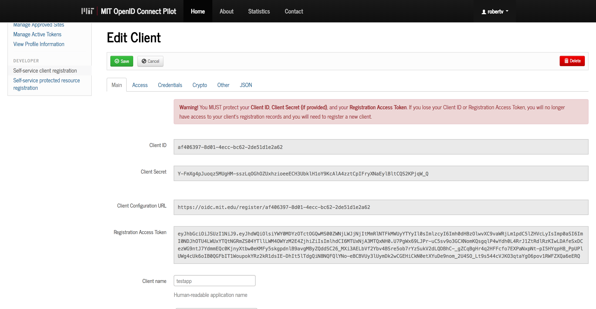
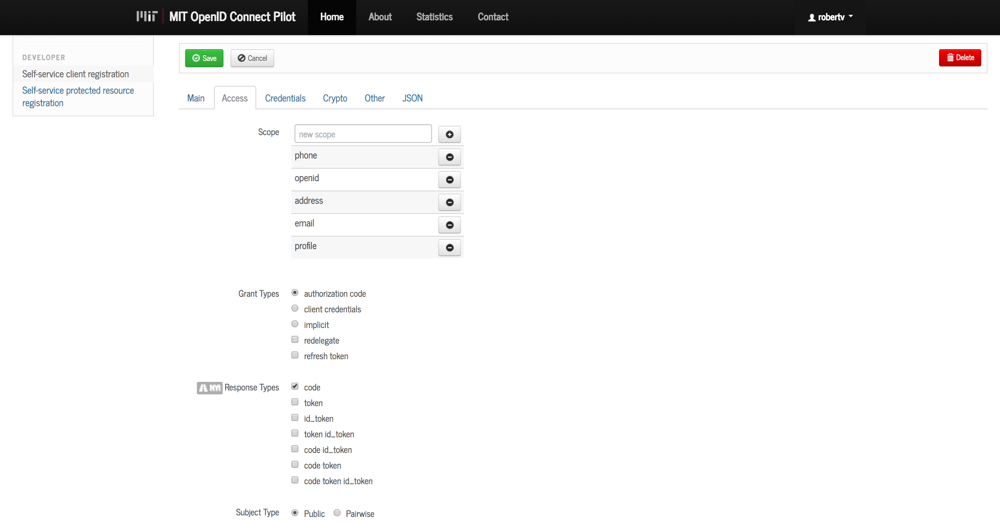

# HOW TO SET UP AND USE MIT OPENID

This guide will walk you through setting up MIT OpenID for your app. The code provided in this guide is a skeleton code for an app (similar to [Catbook](https://github.com/mit6148-workshops/catbook)) with server-side material located in `./src` and client-side material located in `./public`.

If you would like to simply integrate MIT OpenID into your app without following this skeleton, skip over that section.

## Use MIT OpenID from this source code

This code will work correctly for `AuthorizationCode` Oauth2.0 requests (it doesn't matter too much what it is, but if you're curious, go under the section about understanding Oauth2.0). So, some parameters will have to be set as said here. 

### Step 1: Get your app's client ID

Go on [oidc.mit.edu](https://oidc.mit.edu/) and log in. You should be able to log in with your kerberos and kerberos password. 

Once logged, you should see the following screen: 
.

The next step is to go on `Self-service client registration` under the `Developer`'s section. Once you click there, click on `Register a new client`. Then, you get the following screen:

.

Now, you have to complete all the necessary information. The `client name` is the name of your app: *this is the name people will see when they are prompted to authorize your app*. Make sure to give it a clear and "representative of your app" name.

For `redirect URI(s)`, there are two cases: 
1. If your app is under development (i.e. you are running it locally on your computer), put `http://localhost:{port}/`. Make sure to put the port that you're using. So, if your port is `3000`, then put  `http://localhost:3000/` (*without the brackets!*).
2. If your app is not under development or is deployed, you will put whatever path you were given from your deployment provider. For example, a [Heroku](https://www.heroku.com/) app will have a url similar to `https://mysterious-headland-54722.herokuapp.com/` (unless you have registered for your own domain), which is what you will put for `redirect URL(s)`.

For `Logo`, you will enter whatever URL you may have. It's optional though. Everything else is optional as well. Finally, I don't think it's important, but you should select your `application type` to be `Web`. When you're done, click on `Save`!

It will refresh the page, and you should see something like this (**by the way, this app was deleted so it's pointless to attempt to copy the id and secret and RegistrationAccessToken**):
.

Once you have this, as it clearly says in **red**, you MUST save your `ClientID`, `ClientSecret`, and `RegistrationAccessToken` otherwise you will not be able to access this screen again (for this app you created). So, make sure you save it! (I lost an app myself :confounded: ).

Next and final thing to do is to go on the `Access` tab. You will see this: 
.

Here's where you choose the scopes. There are many more scopes (which are suggested on keypress). These scopes are simply what your application will need to access from the user. Put whatever you need there and **remove whatever you do not need** there (some users do not like to share certain information, such as their phone number). 

Below that, make sure to toggle `refresh token`. This will be needed by `passportJS`! (I'm actually not sure of this, but I am pretty sure it needs the refresh token :p). 

Then, ignore everything else and click on `Save`. Now, you should be ready to move onto **STEP 2**.

**NOTE:** The grant type has to stay `authorization code`!!! Otherwise, this will not work. You will need to use a completely (semi-completely) different way of authentication. Also, those other grant types serve a different purpose (which you can understand if you look through the guide below). 

### Step 2: Clone this source code and fix the code accordingly

1. Clone this source code. Then, open `./src/openid_credentials.js`. In this file, replace wherever necessary with your new `clientID` and `ClientSecret`. 

2. Then, open `./src/db.js` and enter your MongoDB URI from [MLAB](https://mlab.com/). 

3. *If you have already deployed your app:* Change the host in `./src/passport.js` to the right host. There is a comment about this. *Make sure your host doesn't include any "/" at the end*. 

4. Finally, the last thing is to modify your `User` model. Go into `user.js` and remove the parameters that are not needed and add whatever is needed. 

Now you may ask, **"How do I know what's needed (i.e. what is in this user object that I receive from MIT's OpenID)?"** MIT OpenID doesn't have documentation that specify these; however, you can test this out with modifying `./src/passport.js`. Inside of the big function `passport.use('oidc', new OAuth2Strategy ...`, there is a comment that says `// uncomment this to see what your user object looks like`. You just have to uncomment the next line and check your logs. This may cause an error as your server handles the request, but it's okay because (in theory) you will fix your user model to have only the parameters you requested (which are given in that object).

Now you should be good! Make sure to run `npm install` when you are ready to run your app.

## Integrate MIT OpenID from existing source code

`This section is under development`
For now, simply try to look at the source code and try to integrate MIT OpenID with your app is. 

## Following the Passport documentation

How did I know how to use `passport` for this? I simply went on [passport](http://www.passportjs.org/docs/oauth/) and clicked on the `Oauth` section. I also copied a bit from [Catbook](https://github.com/mit6148-workshops/catbook).

For `morgan`, I simply went on [morgan npm](https://www.npmjs.com/package/morgan)'s guide. This guide is very straightforward.

## Understand how OAuth2.0 Work

Below is simply a compiled list of links that helped me understand how OAuth2.0 works. It's valuable that this makes sense because you can better understand what the code is doing and easily integrate other authentication methods (e.g. Google, Twitter, etc) into your app. 

### Guides that assume little background

I recommend reading / watching from many sources. That gives many different perspectives to understanding how OAuth2.0 works with. I tried to put the links below in order of low assumptions to some assumptions. 

- [InterSystems Learning Services: OAuth 2.0: An Overview](https://www.youtube.com/watch?v=CPbvxxslDTU): Very good Youtube video.
- [DBA Presents: What is OpenID, OAuth2 and Google Sign In?](https://www.youtube.com/watch?v=1M6gqoGiO2s): Another really good Youtube video.
- [Okta](https://www.oauth.com/oauth2-servers/background/): This article explains it from ground up in a high level manner. It uses code in `php`, but that's not too much of a drawback.
- [Le Deng: OAuth 2 Explained](https://www.youtube.com/watch?v=L1PDqJkedZ0): Kind of slow video, but also good.
- [Tech Primers: What is OAuth2? How does OAuth2 work?](https://www.youtube.com/watch?v=bzGKgC3N7SY): Youtube video.

### Guides that assume some background

I tried to put the links below in order of low assumptions to more assumptions. Some of these videos are long; if you are using Chrome, I'd suggest using an extension that allow you to increase video speed (like [Video Speed Controller](https://chrome.google.com/webstore/detail/video-speed-controller/nffaoalbilbmmfgbnbgppjihopabppdk?hl=en)).

- [Oracle Learning Library: OAuth Introduction and Terminology](https://www.youtube.com/watch?v=zEysfgIbqlg)
- [Oracle Learning Library: OAuth Grant Types](https://www.youtube.com/watch?v=1ZX7554l8hY)
- [Oracle Learning Library: OAuth Codes And Tokens](https://www.youtube.com/watch?v=8CHpnTysVOo)
- [Oracle Learning Library: An Introduction To OpenID Connect](https://www.youtube.com/watch?v=6DxRTJN1Ffo)
- [Oracle Learning Library: OpenID Connect Flows](https://www.youtube.com/watch?v=WVCzv50BslE&t=289s)
- [Google Developers: Google I/O 2012 - OAuth 2.0 for Identity and Data Access](https://www.youtube.com/watch?v=YLHyeSuBspI&t=2669s): This uses python, but is very good if you have time to kill.

### Guides that assume a lot background (or are kind of unrelated)

- [O'Reilly - Safari: Express.js Middleware Demystified](https://www.safaribooksonline.com/blog/2014/03/10/express-js-middleware-demystified/)
- [Request NPM](https://www.npmjs.com/package/request)
- [StackExchange: Should we store accesstoken in our database for oauth2?](https://security.stackexchange.com/questions/72475/should-we-store-accesstoken-in-our-database-for-oauth2)
- [StackOverflow: How do I redirect in expressjs while passing some context?](https://stackoverflow.com/questions/19035373/how-do-i-redirect-in-expressjs-while-passing-some-context)
- [Oauth2.0 Official Website](https://oauth.net/2/)
- [StackOverflow: OAuth2, Using POST and Yet… Method Not Allowed?
](https://stackoverflow.com/questions/44685286/oauth2-using-post-and-yet-method-not-allowed)
- [ietf](https://tools.ietf.org/html/rfc7519)

## License

    Copyright 2018 Robert M. Vunabandi

    Permission is hereby granted, free of charge, to any 
    person obtaining a copy of this software  and associated
    documentation files (the "Software"), to deal in the 
    Software without restriction, including without limitation
    the rights to use, copy, modify, merge, publish, distribute,
    sublicense, and/or sell copies of the Software, and to 
    permit persons to whom the Software is furnished to do 
    so, subject to the following conditions:

    The above copyright notice and this permission notice shall 
    be included in all copies or substantial portions of the 
    Software.

    THE SOFTWARE IS PROVIDED "AS IS", WITHOUT WARRANTY OF 
    ANY KIND, EXPRESS OR IMPLIED, INCLUDING BUT NOT LIMITED 
    TO THE WARRANTIES OF MERCHANTABILITY, FITNESS FOR A 
    PARTICULAR PURPOSE AND NONINFRINGEMENT. IN NO EVENT SHALL 
    THE AUTHORS OR COPYRIGHT HOLDERS BE LIABLE FOR ANY CLAIM, 
    DAMAGES OR OTHER LIABILITY, WHETHER IN AN ACTION OF 
    CONTRACT, TORT OR OTHERWISE, ARISING FROM, OUT OF OR IN 
    CONNECTION WITH THE SOFTWARE OR THE USE OR OTHER DEALINGS 
    IN THE SOFTWARE.