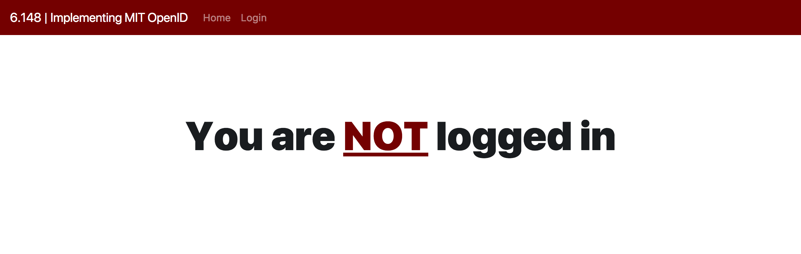
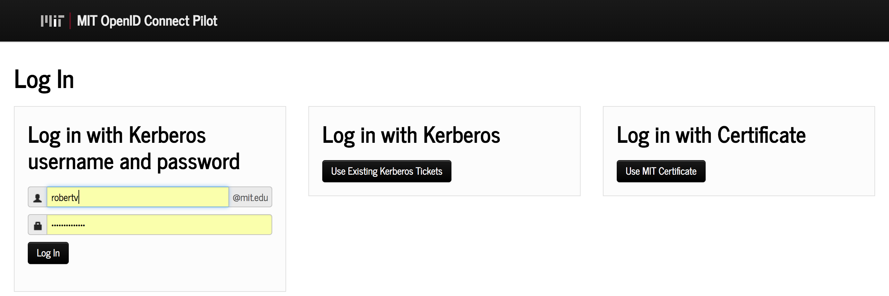
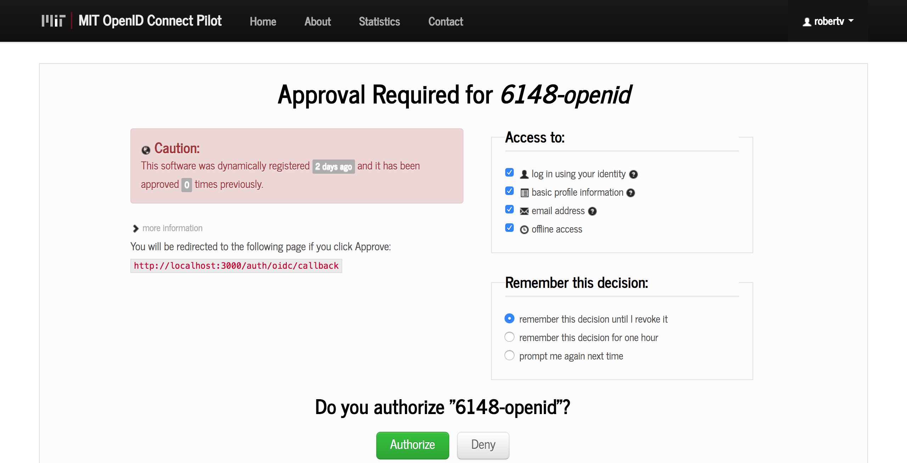
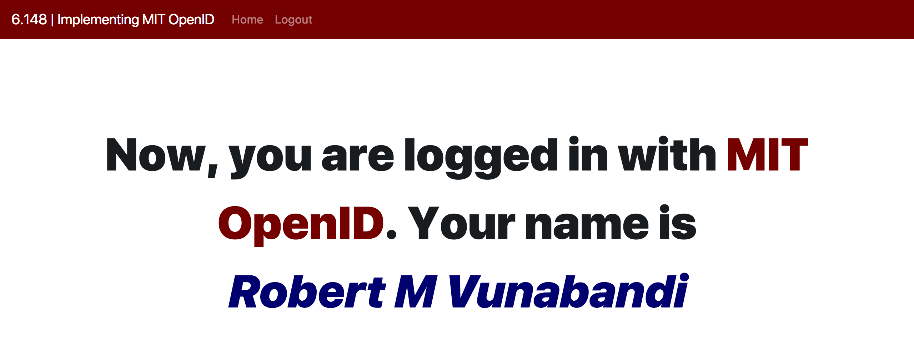

# HOW TO SET UP AND USE `MIT OpenID Connect Pilot`

This guide will walk you through setting up [MIT OpenID Connect Pilot](https://oidc.mit.edu/) (**MOIDC**) for your app, which is a mean of providing authentication through kerberos for MIT students and affiliates, using [PassportJS](http://www.passportjs.org/) and the `npm` package [passport-mitopenid](https://www.npmjs.com/package/passport-mitopenid).

The code provided in this guide is a skeleton code for an app (similar to [Catbook](https://github.com/mit6148-workshops/catbook)) with server-side material located in `./src` and client-side material located in `./public`.

If you would like to simply integrate MIT OpenID into your app without following this skeleton, skip over to that the section on [**INTEGRATE `MIT OpenID` FROM AN EXISTING SOURCE CODE**](#integrate-mit-openid-from-an-existing-source-code).

**NOTE:** This guide assumes that you are MIT affiliated. You will not be able to log into [MOIDC](https://oidc.mit.edu/) otherwise. This guide also assumes you are using `NodeJS` as an engine and running your server with `ExpressJS`. Finally, this guide assumes that you are using a MongoDB database.

## USE `MIT OpenID` FROM THIS SOURCE CODE

This code will work correctly for `AuthorizationCode` Oauth 2.0 requests (see the section about [understanding How Oauth 2.0 Works](#understanding-how-oauth-20-works)). 

### Step 1: Get your app's client credentials

Go on [MOIDC](https://oidc.mit.edu/) and log in. You should be able to log in with your kerberos and kerberos password. 

Once logged, you should see the following screen: 


Next step, go on `Self-service client registration` under the `Developer`'s section. Once you there, click on `Register a new client`. Then, you get the following screen:


Now, you need to complete all the necessary information.
- `client name`: the name of your app: *this is the name people will see when they are prompted to authorize your app*. Make sure to give it a clear and "representative of your app" name.

- `redirect URI(s)`: there are two cases: 
    - If your app is under development (i.e. you are running it locally on your computer), put `http://localhost:{port}/`.
    - If your app is not under development or is deployed, you will put whatever path you were given from your deployment provider. For example, a [Heroku](https://www.heroku.com/) app will have a url similar to `https://mysterious-headland-54722.herokuapp.com/` (unless you have registered for your own domain), which is what you will put for `redirect URL(s)`.
    - You may also have a redirect `url` to a specific endpoint (say, `'/home'`). If so, use that then. 

- `Logo` (_optional_): Enter whatever URL you have for your application's logo. 

- Everything else is _optional_. Set your `application type` to be `Web`. When you're done, click on `Save`!

It will refresh the page, and you should see something like this (**by the way, this app was deleted so it's pointless to attempt to copy the id and secret and RegistrationAccessToken**):


Once you have this and as it clearly says in **red**, **you MUST save your `ClientID`, `ClientSecret`, and `RegistrationAccessToken`**, otherwise you will not be able to access this screen again. So, make sure you save it! (I lost an app myself :confounded: ).

Next and final thing to do is to go on the `Access` tab. You will see this: 


Here's where you choose the scopes ([what are scopes?](https://docs.apigee.com/api-services/content/working-scopes)). There are many more scopes (which are suggested on keypress). They are simply what your application will need to access from the user. Put whatever you need there and **remove whatever you do not need** there (some users do not like to share certain information, such as their phone number, so removing what you do not need makes users more likely to use your application since it means they'd be sharing less data). 

Below that, make sure to toggle `refresh token`. This will be needed by `passportJS`! (I'm actually not entirely sure of this). 

Also, the grant type has to stay `authorization code`!!! Otherwise, this will not work. You will need to use a completely (semi-completely) different way of authentication. Also, those other grant types serve a different purpose (which you can understand if you look through the guide below). 

Then, you can ignore everything else and click on `Save`. Now, you should be ready to move onto **STEP 2**.


### Step 2: Clone this source code and fix the code accordingly

1. Clone this source code. Then, open `./src/passport.js`. In this file, replace wherever necessary with your new `clientID` and `ClientSecret`. 

2. Then, open `./src/db.js` and enter your MongoDB URI from [MLAB](https://mlab.com/) (or any other database resource you may have). 

3. *If you have already deployed your app:* Change the host in `./src/passport.js` to the right host. There is a comment about this. *Also, make sure your host doesn't include any "/" at the end*. If you have not deployed it, make sure to use the correct port.

4. Finally, the last thing is to modify your `User` model. Go into `user.js` and remove the parameters that are not needed and add whatever is needed. 

Now, you may ask, **"How do I know what's needed (i.e. what is in this user object that I receive from MIT's OpenID)?"** Although MIT OpenID doesn't have documentation that specify these things, you can test this out with modifying `./src/passport.js`. Inside of the function `passport.use('mitopenid', new MITStrategy ...`, there is a comment that says `// uncomment the next line to see what your user object looks like`. This may cause an error as your server handles the request, but it's okay because (in theory) you will fix your user model to have only the parameters you requested (which are given in that object).

Now you should be good! Make sure to run `npm install` when you are ready to run your app.

Your app should look like this:

And lead you to this page after you click on login:

Then in this page, you confirm that you want to add the app:

Then when you're logged in, it will take you here:


## INTEGRATE `MIT OpenID` FROM AN EXISTING SOURCE CODE

To integrate MIT OpenID to your app, we need to make a set of assumptions about your file structure. 
1. Your server files are in `./src`, and your public files are in `./public`.
2. Your main file (the file that runs when you type `npm start` on your console) is named `app.js` and is located in `./src/app.js`. 

For the rest of this guide:
- `AppUser` refers to the user of your app, and
- `AppClient` refers to your application's server

If you are starting a new project, go to the section on [**USE `MIT OpenID` FROM THIS SOURCE CODE**](#use-mit-openid-from-this-source-code) instead.

Finally, to implement this, we made use of the `npm` module [passport-mitopenid](https://www.npmjs.com/package/passport-mitopenid).

### Step 1: Install Dependencies 

Make sure you have installed all necessary dependencies.  

Run the following: 

    npm install --save express-session passport passport-mitopenid 

What each of those do (which you do not need to know):
- `express-session`: We use this to save the `AppUser`'s `AccessToken`, which is like a key that allows your `AppClient` to get information about that user, on the `AppUser`'s browser as a [web cookie](https://developer.mozilla.org/en-US/docs/Web/HTTP/Cookies). 
- `passport`: [`PassportJS`](http://www.passportjs.org/) is our mean of authenticating the user.
- [`passport-mitopenid`](https://www.npmjs.com/package/passport-mitopenid): MIT OpenID abides by the [Oauth 2.0](https://oauth.net/2/) protocol, so we need the passport's implementation Strategy of Oauth 2.0 for MOIDC. passport-mitopenid is just the right passport-strategy for this.

### Step 2: Hook Up the right endpoints to your frontend

You need an endpoint on your front-end that allows a user to login with MIT OpenID. We'll name that endpoint `'/auth/mitopenid'`. 

#### 2.1: Set `Login` and `Logout` Endpoints on Your Frontend 

Set your `Login` button's `href` on your front-end to be `'/auth/mitopenid'` and set your `Logout` button's `href` to be `'/logout'`. Here's an example: 

```javascript
function newNavbarItem(text, url) {
	let itemLink = document.createElement('a');
	itemLink.className = 'nav-item nav-link';
	itemLink.innerHTML = text;
	itemLink.href = url;

	return itemLink;
}

function renderNavbar(user) {
	const navbarDiv = document.getElementById('nav-item-container');
	navbarDiv.appendChild(newNavbarItem('Home', '/'));
	// NOTE: this check is a lowkey hack
	if (user._id) {
		navbarDiv.appendChild(newNavbarItem('Logout', '/logout'));
	} else {
		// set the login button's href to point to '/auth/oidc'
		navbarDiv.appendChild(newNavbarItem('Login', '/auth/mitopenid'));
	}
}
```

Our `renderNavbar` method sets the login button's href to point to `'/auth/mitopenid'`. Since this app is running with a server, when a user clicks on this login button, it leads them to `http://localhost:3000/auth/mitopenid`, which we will implement on the backend later along with the `'/logout'` endpoint leading to `http://localhost:3000/logout`.

If you have your own way of implementing your navbar (or if your login button is not on the navbar), just make sure to make a button with the `'a'` HTML tag that has `href='/auth/mitopenid'` so that it points to the correct endpoint on your backend to log the user in using MIT OpenID.

#### 2.2: Run `'/api/whoami'` When Your Frontend Loads 

Finally, we need to run a get request to `'/whoami'` at the start of your app to get the `AppUser`'s credential and "log them" in (similar to what [Catbook](https://github.com/mit6148-workshops/catbook) did). For us, we make the get request inside of `./public/js/script.js` (which is named `./public/js/index.js` on the [Catbook](https://github.com/mit6148-workshops/catbook) app), which returns an empty object if the user is not logged in or returns a user object *from the MongoDB mLab database* if the user is logged in. 

I.e., we do the following on load: 

```javascript
get('/api/whoami', {}, function (user) {
	// do something with "user", which is {} if 
	// the AppUser is not logged in and 
	// { _id: ..., ...} if AppUser is logged in
	// for example: 
	renderNavbar(user);
	renderPage(user);
});
```

**NOTE:** This was [Catbook](https://github.com/mit6148-workshops/catbook)'s way of implementing this part which turned out to be a bit hacky. There are multiple ways of differentiating a user's state from being "logged-in" to being "logged-out"/"not-logged-in".  

### Step 3: Implement your Backend Endpoints

To keep our work clean, we will split the work of authenticating the user into multiple files (and maybe folders).

#### 3.1. Create `passport.js`

We will need to create a file just to handle what [passport](http://www.passportjs.org/) is doing to log `AppUser` in. Create the file `passport.js` inside of your `./src` directory, and then paste the following code into it:

```javascript
const passport = require('passport');
const MITStrategy = require('passport-mitopenid').MITStrategy;
// checkpoint 1
const User = require('./models/user');
// checkpoint 2
const host = 'http://localhost:3000';
// checkpoint 3
passport.use('mitopenid', new MITStrategy({
	clientID: 'your client id from https://oidc.mit.edu/',
	clientSecret: 'your client secret from https://oidc.mit.edu/',
	callbackURL: host + '/auth/mitopenid/callback'
}, function(accessToken, refreshToken, profile, done) {
	// checkpoint 4
	User.findOne({openid: profile.id}, function (err, user) {
		if (err) {
			return done(err);
		} else if (!user) {
			// checkpoint 5
			return createUser();
		} else {
			return done(null, user);
		}
	});
	// checkpoint 5 (continued)
	function createUser() {
		const new_user = new User({
			name: profile.name,
			given_name: profile.given_name,
			middle_name: profile.middle_name,
			family_name: profile.family_name,
			email: profile.email,
			openid: profile.sub
		});
		new_user.save(function (err, user) {
			if (err) {
				return done(err);
			}
			return done(null, user);
		});
	}
}));
// checkpoint 6
passport.serializeUser(function (user, done) {
	done(null, user);
});
// checkpoint 7
passport.deserializeUser(function (user, done) {
	done(null, user);
});

module.exports = passport;
```
I put multiple `checkpoints` in the code above so that the comments do not clutter up the space. I explain those comments. More details below.

- With `checkpoint 1`, I want to mention that it assumes that you are using [MongoDB](https://docs.mongodb.com/manual/) and `mongoose`. If you are not, you will need to figure out how to store the user and retrieve inside of the big function call right after `checkpoint 5`.

- With `checkpoint 2`: This `host` variable is your app's `URL`. If your app is to be deployed, make sure to change it. An heroku `URL` would look like `https://mysterious-headland-54722.herokuapp.com` for example. That's the `URL` you would put there. *MAKE SURE **NOT** TO INCLUDE A `'/'` AT THE END!*

- With `checkpoint 5`: In here, it creates the user from the [Mongoose model](http://mongoosejs.com/docs/models.html) `User`. Remember that a `mongoose model`has a specific set of things that it can be. Therefore, the way the user's object is created here matters.

That, should be the only thing you may need to change in this file (unless you're using a different port number, then you will need to change that as well).

Now, although I put `checkpoints` a bit everywhere, for each of those checkpoints, I actually put comments in this demo code. So, if you want to know what they are saying, you can go into the demo code's file for `passport.js` (i.e. this codebase, in `./src/passport.js`) and see what each of those checkpoints mean (I would even suggest taking that code instead of this one since this one has no comments).

#### 3.2. Hook `passport.js` into `app.js`

By now, your app is almost ready to run!

Open your `./src/app.js` (or whichever file gets run when you run `npm start`, which you can see inside your `package.json`).

We need to make sure [passport](http://www.passportjs.org/) actually runs. 

Wherever you import your libraries, add the following 

```javascript
const session = require('express-session');
```

This imports the `express-session` library. 

Then, wherever you import your local dependencies, make sure to import the newly created `passport.js` file with 

```javascript
const passport = require('./passport.js'); 
```

You can also just write

```javascript
const passport = require('./passport');
``` 

because `Javscript` will know it's a Javascript file. Also,that assumes that your `app.js` and `passport.js` live in the same folder. 

Then, before you set up your routes (for example, before placing `app.use('/', views);`), add the following lines:

```javascript
// set up sessions
app.use(session({
	secret: 'session-secret', // <- make sure to make this a more secure secret
	resave: 'false',
	saveUninitialized: 'true'
}));
```

As it says in the comments, make sure to change your secret to something more secure. 

Then, right after that (**and make sure this actually comes after the `session`'s app.use**), add the following lines: 

```javascript
app.use(passport.initialize());
app.use(passport.session());
```

That will hook up [passport](http://www.passportjs.org/) with our app and starts its passport's session mechanism.

Finally, the last thing we need to do here is implement the `authentication routes` (these are done using `app.get(...)` for `GET` requests sent to you `AppClient`). So, after you have set up your routes (for example, after placing `app.use('/', views);`), paste the following: 

```javascript
// authentication routes
app.get('/auth/mitopenid', passport.authenticate('mitopenid'));
app.get('/auth/mitopenid/callback', passport.authenticate('mitopenid', {
	successRedirect: '/',
	failureRedirect: '/'
}));
```

I also added comments as to what they do in this codebase (so again, it's better to copy the file from this codebase than from these snippets). If you remember, we already called the `'/auth/mitopenid'` endpoints on our frontend. That's a good pattern to use: *use it in the front end assuming it exists, then implement it in the backend* (or you can do these in parallel if working in group).

#### 3.3: Implement `'/whoami'` and `'/logout'`
 
Assuming you use the endpoint `'/'` within the `./src/routes/views.js` file, go into that file and add the following line: 

```javascript
router.get('/logout', function (req, res) {
	req.logout();
	res.redirect('/');
});
```

`req.logout()` is a method that `passport` 'magically' adds into our request. This method effectively logs the user out. Then, the method `res.redirect('/');` sends the request to the  `'/'` endpoint, which should (ideally) send the user to the home page (the page they first see whenever they go into the website for the first time). 

Now, assuming you also have an `./src/routes/api.js` folder for your apis, go into that file and add the following: 

```javascript
router.get('/whoami', function (req, res) {
	res.send(req.isAuthenticated() ? req.user : {});
});
```

`req.isAuthenticated()` is another method that `passport` 'magically' adds into our request. This method checks if the user is logged in. If they are not logged in, it just returns `false` (it's a boolean return method). For us, we wanted to return an empty object in case our user was not logged in, which is what that [ternary](https://developer.mozilla.org/en-US/docs/Web/JavaScript/Reference/Operators/Conditional_Operator) operation does. Somehow, the user's object is within the request object (i.e. `req.user`). That is also something [passport](http://www.passportjs.org/) adds 'magically': it "places" (quote because it doens't really place) the user object inside of `req.user` for every requests sent to this server.

**What if I do not have an `./src/routes/api.js` file?** 

Simply go into your `./src/app.js` and add the following: 

```javascript
app.get('/whoami', function (req, res) {
	res.send(req.isAuthenticated() ? req.user : {});
});
```

That assumes that somewhere in your code, you have:

```javascript
const app = express();
```

That also means that your will access the `'/whoami'` endpoint without the `'/api'` before it.

**What if I do not have an `./src/app.js` file?** 

We assumed that you have it! Otherwise, how did you even get to this step? Some people name that file `./src/index.js` instead of `./src/app.js`. 

Anyway: Now, if you run `npm start`, your app (in theory) should be able to run and provide authentication with MIT OpenID.

## FOLLOWING THE `PassportJS` DOCUMENTATION

How did I know how to use `passport` for this? I simply went on [passport](http://www.passportjs.org/docs/) and clicked on the `Oauth` section. I also copied a bit from [Catbook](https://github.com/mit6148-workshops/catbook).

I highly suggest reading through these documentations. They make understanding [passport](http://www.passportjs.org/) a lot easier than plugging random stuffs into the code.

## UNDERSTANDING HOW `OAuth 2.0` WORKS

Below is simply a compiled list of links that helped me understand how OAuth 2.0 works. 

After having gone through them, this whole [passport](http://www.passportjs.org/) 'magic' made sense to me! So, I think it's valuable that this 'magic' makes sense because you can better understand what the code is doing and easily integrate other authentication methods (e.g. Google, Twitter, etc) into your app and even have an app with multiple authentication methods. 

### Guides That Assume Little Background

I recommend reading / watching about OAuth 2.0 from many sources. That gives many different perspectives to understanding how to works with this protocol. I tried to put the links below in order of low assumptions to some assumptions. 

- [InterSystems Learning Services: OAuth 2.0: An Overview](https://www.youtube.com/watch?v=CPbvxxslDTU): Very good Youtube video.
- [DBA Presents: What is OpenID, OAuth2 and Google Sign In?](https://www.youtube.com/watch?v=1M6gqoGiO2s): Another really good Youtube video.
- [Okta](https://www.oauth.com/oauth2-servers/background/): This article explains it from ground up in a high level manner. It uses code in `php`, but that's not too much of a drawback.
- [Le Deng: OAuth 2 Explained](https://www.youtube.com/watch?v=L1PDqJkedZ0): Kind of slow video, but also good.
- [Tech Primers: What is OAuth2? How does OAuth2 work?](https://www.youtube.com/watch?v=bzGKgC3N7SY): Youtube video.

### Guides that assume some background

I tried to put the links below in order of low assumptions to more assumptions. Some of these videos are long; if you are using Chrome, I'd suggest using an extension that allow you to increase video speed (like [Video Speed Controller](https://chrome.google.com/webstore/detail/video-speed-controller/nffaoalbilbmmfgbnbgppjihopabppdk?hl=en)).

- [Oracle Learning Library: OAuth Introduction and Terminology](https://www.youtube.com/watch?v=zEysfgIbqlg): Youtube video.
- [Oracle Learning Library: OAuth Grant Types](https://www.youtube.com/watch?v=1ZX7554l8hY): Youtube video.
- [Alex Bilbie: A Guide To OAuth 2.0 Grants](https://alexbilbie.com/guide-to-oauth-2-grants/): blog post.
- [Oracle Learning Library: OAuth Codes And Tokens](https://www.youtube.com/watch?v=8CHpnTysVOo): Youtube video.
- [Oracle Learning Library: An Introduction To OpenID Connect](https://www.youtube.com/watch?v=6DxRTJN1Ffo): Youtube video.
- [Oracle Learning Library: OpenID Connect Flows](https://www.youtube.com/watch?v=WVCzv50BslE&t=289s): Youtube video.
- [Google Developers: Google I/O 2012 - OAuth 2.0 for Identity and Data Access](https://www.youtube.com/watch?v=YLHyeSuBspI&t=2669s): This Youtube video uses python, but is very good.

### Guides that assume a lot background (or are kind of unrelated)

- [O'Reilly - Safari: Express.js Middleware Demystified](https://www.safaribooksonline.com/blog/2014/03/10/express-js-middleware-demystified/): A blog post.
- [Request NPM](https://www.npmjs.com/package/request): Documentations for `request` on `npm`.
- [StackExchange: Should we store accesstoken in our database for oauth2?](https://security.stackexchange.com/questions/72475/should-we-store-accesstoken-in-our-database-for-oauth2)
- [StackOverflow: How do I redirect in expressjs while passing some context?](https://stackoverflow.com/questions/19035373/how-do-i-redirect-in-expressjs-while-passing-some-context)
- [Oauth 2.0 Official Website](https://oauth.net/2/)
- [StackOverflow: OAuth2, Using POST and Yet… Method Not Allowed?
](https://stackoverflow.com/questions/44685286/oauth2-using-post-and-yet-method-not-allowed)
- [Internet Engineering Task Force (IETF)](https://tools.ietf.org/html/rfc7519): This is probably the most in-depth source. This is where OAuth 2.0 protocol is defined, so if you really want to understand everything about it, you should go here. Also, it's surprisingly understandable!